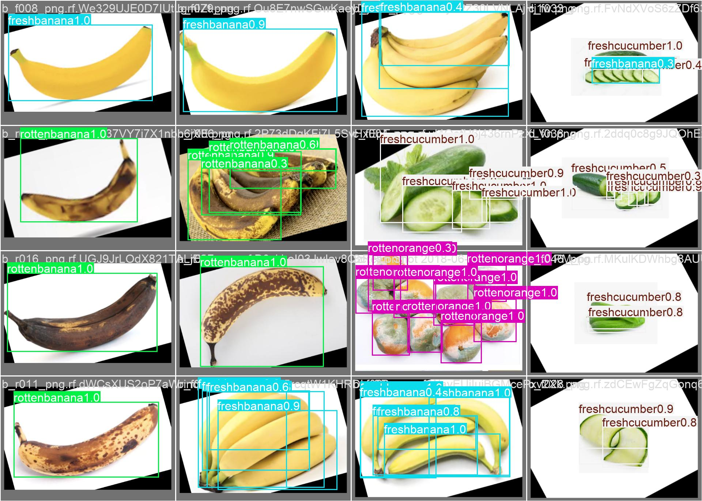
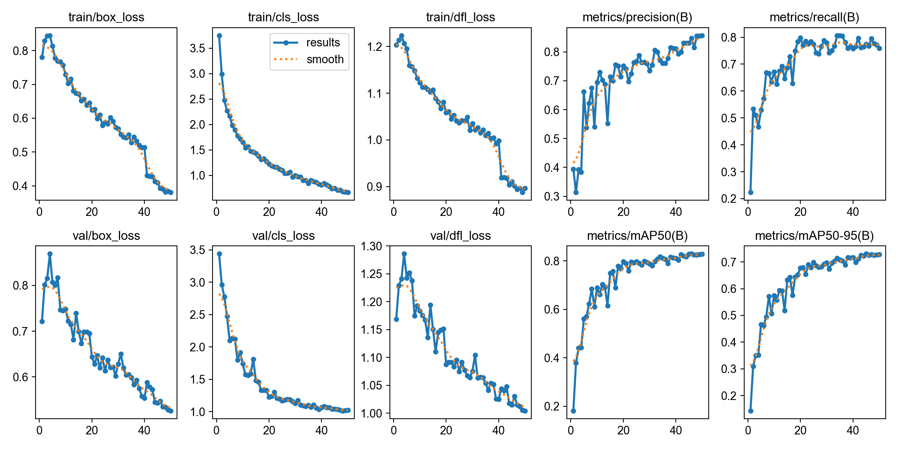

# Distributed Edge AI — Real-Time Produce Inspection

A two-device edge inference system that detects and classifies fresh and defective produce in real time, with confidence-based cross-device consensus and automatic upload to Google Cloud Storage.

---

## Overview

Manual produce inspection in food-processing and distribution centers is slow, inconsistent, and hard to scale. This system deploys two NVIDIA Jetson Orin Nano devices — each connected to a USB camera — running a fine-tuned YOLOv11n model locally on the edge. The devices exchange detection results over a direct-Ethernet ZeroMQ link, apply confidence-based consensus to pick the strongest detection each frame, upload annotated frames to Google Cloud Storage, and serve a live annotated video stream via Flask to any browser on the local network.

---

## Architecture

```
Camera ──► Jetson Orin Nano 1 (server.py)
                     │
               ZeroMQ PAIR
               TCP port 5555
                     │
Camera ──► Jetson Orin Nano 2 (client.py)
                     │
          Confidence-based consensus
                     │
          ┌──────────┴──────────┐
          │                     │
   GCS bucket             Flask stream
 (annotated frames)       http://:5000
```

**Nano 1 — `models/server.py`**
- Binds a ZeroMQ PAIR socket on `tcp://*:5555`
- Runs YOLOv11n inference at 12 FPS (FP16 half-precision)
- Hosts a Flask app with MJPEG live stream (`/video`) and JSON result endpoint (`/result`)
- Uploads winning-confidence annotated frames to Google Cloud Storage

**Nano 2 — `models/client.py`**
- Connects to Nano 1's ZeroMQ socket
- Runs the same YOLOv11n model independently at 12 FPS (FP16)
- Exchanges detection JSON with Nano 1 each frame; the device with higher confidence wins
- Also uploads frames to GCS when it wins the consensus

**Cloud — Google Cloud Platform**
- GCS bucket stores annotated detection frames for audit and retraining
- GCP Compute Engine VM (NVIDIA T4 GPU) was used for model training

---

## Features

- Real-time object detection at 12 FPS across two concurrent edge devices
- Classifies produce type and freshness state — e.g., `Fresh Apple`, `Rotten Banana`, `Defective Tomato`
- Two-device confidence consensus over ZeroMQ: highest-confidence detection is selected each frame
- Auto-reconnect if either device goes silent for ~10 seconds
- Live annotated video stream via Flask, viewable from any browser on the local network
- Automatic GCS upload of winning detection frames for retraining data collection
- FP16 half-precision inference for efficient GPU utilization on Orin Nano
- Standalone single-device mode (`models/model.py`) for testing without a second device

---

## Tech Stack

| Layer | Technology |
|---|---|
| Model | YOLOv11n (Ultralytics) |
| Inference | OpenCV, PyTorch, CUDA (FP16) |
| Device communication | ZeroMQ PAIR socket over direct Ethernet |
| Web stream | Flask (MJPEG + JSON polling) |
| Cloud storage | Google Cloud Storage |
| Training | Ultralytics, GCP Compute Engine (NVIDIA T4) |
| Hardware | 2× NVIDIA Jetson Orin Nano, 2× USB cameras |
| Language | Python 3 |

---

## Dataset

The model was trained on a merged dataset of approximately **10,750 images** across **26 produce classes**, covering fresh and defective states of common fruits and vegetables.

**Sources:**
- [Food Freshness Dataset](https://www.kaggle.com/datasets/ulnnproject/food-freshness-dataset) (Kaggle) — downloaded via `src/dataset.py`
- Bounding-box annotations added through Roboflow Universe

An earlier training attempt using the LVIS Fruits and Vegetables dataset (63 classes) was abandoned due to class imbalance and poor mAP50-95 after 100 epochs. The setup script for that run is preserved at `configs/setup_training.sh`.

---

## Setup & Run

### Prerequisites

- 2× NVIDIA Jetson Orin Nano with USB cameras on `/dev/video0`
- Python 3.9+
- GCP service account key at `configs/keys.json` (gitignored — provision from GCP IAM and grant Storage Object Admin on the target bucket)
- Both devices on the same network (direct Ethernet recommended for latency)

### Install dependencies

```bash
pip install -r requirements.txt
```

### Two-device inference

**On Nano 1 (server — binds ZeroMQ, serves web stream):**
```bash
python models/server.py
```
The Flask dashboard is accessible at `http://<nano1-ip>:5000`. The MJPEG stream is at `/video`; the latest detection JSON is at `/result`.

**On Nano 2 (client — connects to Nano 1):**
```bash
python models/client.py
# Prompts: "Enter Nano 1's IP address: "
```

### Single-device inference

For standalone testing without a second device:
```bash
python models/model.py
```
This runs inference on `/dev/video0` and uploads detections directly to GCS.

### Retrain the model

```bash
# Download the Kaggle dataset
python src/dataset.py

# Place your annotated data.yaml at the project root, then train
python src/train.py
```

Trained weights are saved to `runs/detect/<run>/weights/best.pt`. The pretrained YOLOv11n base (`yolo11n.pt`) is fetched automatically by Ultralytics on first run.

> **Hardware note:** Inference scripts use `device=0` (GPU) and `half=True` (FP16). For CPU-only testing, set `device="cpu"` and `half=False` in the relevant script.

---

## Results

Training ran for 50 epochs on GCP (NVIDIA T4). Final validation metrics on the held-out set:

| Metric | Value |
|---|---|
| mAP50 | 0.828 |
| mAP50-95 | 0.728 |
| Precision | 0.857 |
| Recall | 0.759 |

**Validation predictions (epoch 50):**



**Training curves:**



Live inference examples from the Orin Nano are in [`Example_Results/`](Example_Results/).

---

## Team

This was a four-person project: **Jake Wang, Junwen Yu, Sweden Agunenye, and Jooahn Park.**

Jake Wang owned the training pipeline, dataset aggregation, and model versioning.

---

## A Note on AI Assistance
All code, model training, dataset curation, and system architecture in this repository were designed and implemented by the team members listed above. Claude (Anthropic) was used solely to clean up and professionalize the presentation of this repository — formatting the README, removing coursework-specific language, and tidying documentation. No code was generated, suggested, or modified by AI.
